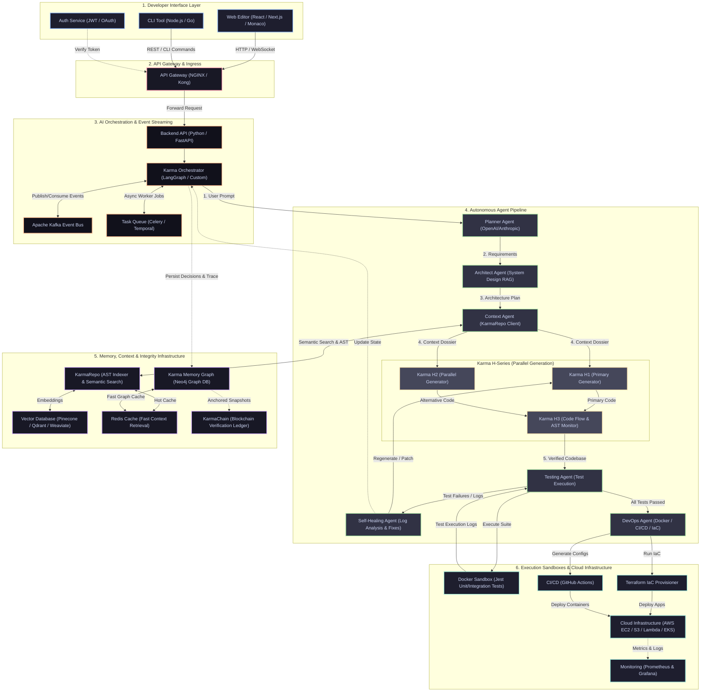
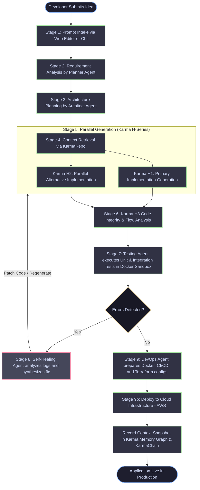

# StackPilot AI

> **AI that builds software with you and understand your projects .**

StackPilot AI is an autonomous, multi-agent software engineering platform engineered to transform high-level software ideas into production-ready, tested, and deployed applications. Instead of treating artificial intelligence as a disconnected snippet generator or an autocomplete utility, StackPilot AI unifies the entire software development lifecycle (SDLC) into a continuous, self-operating engineering pipeline. Through coordinated specialist agents operating inside an integrated developer environment, the platform autonomously handles architecture planning, semantic codebase retrieval, parallel code synthesis, multi-stage testing, self-healing bug remediation, and cloud deployment.

At the core of the platform is the **Karma Engine**—an event-driven multi-agent orchestration runtime that coordinates specialized agents across every phase of software creation. By orchestrating domain-specific agents rather than relying on a single monolithic prompt, StackPilot decomposes engineering problems into structured planning, system design, implementation, and quality assurance workflows. The Karma Engine dynamically manages dependencies between agents, dispatches tasks, and enforces automated validation feedback .

Conventional AI coding assistants suffer from fundamental limitations: they lose context over long-running sessions, operate without deep awareness of large codebases, require developers to juggle fragmented tools, and stop at generating isolated blocks of unverified code. StackPilot AI eliminates these barriers by coupling its multi-agent orchestration with persistent contextual memory (**Karma Memory Graph**), repository-wide AST-based semantic intelligence (**KarmaRepo**), cryptographic snapshot verification (**KarmaChain**), and a redundant parallel generation subsystem (**Karma H-Series System**).

Whether operated through its browser-based developer studio or lightweight CLI, StackPilot AI enables developers to shift focus from low-level boilerplate and toolchain glue to architectural intent, while coordinated agents manage the operational mechanics of building, verifying, and deploying software.

---

## ✨ Overview

* **Autonomous Multi-Agent Architecture**: Replaces single-turn chatbots with a specialized pipeline of dedicated agents (Planner, Architect, Context, Karma H-Series Code Generators, Testing, Self-Healing, and DevOps).
* **The Karma Engine**: An event-driven orchestration backbone powered by Python (FastAPI), LangGraph/custom agent systems, task queues (Celery/Temporal), and Apache Kafka, ensuring deterministic progression and feedback management across the SDLC.
* **Persistent Context Retention**: Combines vector memory with a property graph database (Neo4j) to track architectural decisions, dependency trees, prompt lineage, and code evolution over time.
* **Integrity via KarmaChain**: Employs a blockchain ledger and smart contract verification layer to anchor verified context snapshots, preventing hallucination drift and unauthorized state mutation.
* **Dual-Generator Reliability**: Deploys the **Karma H-Series** engine, running primary (H1) and parallel alternative (H2) code generators concurrently while a supervisory monitor (H3) continuously verifies AST integrity, syntax, and dependency flow.
* **Automated Sandbox Verification & Self-Healing**: Executes unit and integration test suites within isolated Docker sandboxes (using Jest), autonomously parsing error logs and synthesizing fixes to repair faulty modules before deployment.
* **Cloud-Native Deployment Automation**: Provisions containerized workloads to cloud infrastructure (such as AWS EC2, S3, Lambda, and Kubernetes) orchestrated with Terraform and GitHub Actions CI/CD pipelines.

---

## 🚨 Problem

Modern software development with AI tools is constrained by four fundamental :

### 1. AI Context Amnesia
Large Language Models operate within finite context windows and lack durable state persistence. As development sessions extend over days or weeks, LLMs gradually lose awareness of architectural decisions, interface contracts, internal dependencies, and project conventions established in earlier iterations. Developers are repeatedly forced to restate requirements, re-upload schemas, and manually steer models back onto architectural guidelines.

### 2. Fragmented Development Workflow
The software development lifecycle requires continuous context-switching across isolated tools: requirement trackers, whiteboarding tools, code editors, debuggers, terminal environments, CI/CD dashboards, and cloud deployment consoles. Existing AI coding assistants function merely as local code completion plugins, assisting with individual functions while leaving the developer to manually bridge the gap between design, implementation, validation, and operations.

### 3. Lack of Repository-Level Understanding
Enterprise and non-trivial applications span hundreds of files, deep dependency graphs, and implicit architectural patterns. Conventional AI assistants struggle with large repositories because they cannot continuously index, extract, and semantically retrieve relevant files, modules, documentation, and architectural decisions. Without holistic codebase comprehension, generated code often violates existing conventions, breaks upstream callers, or duplicates existing logic.

### 4. Limited AI Autonomy
Current AI developer tools remain passive autocomplete engines. They cannot independently run builds, execute tests, interpret stack traces, refactor breaking changes, or provision deployment infrastructure. When generated code fails, the burden of debugging, repairing, and re-validating falls entirely back onto the human developer, preventing AI from functioning as a truly autonomous engineering partner.

---

## 💡 Solution

StackPilot AI addresses each architectural bottleneck with dedicated, integrated subsystems:

| Problem | StackPilot Solution | Architectural Mechanism |
| :--- | :--- | :--- |
| **Context Amnesia** | **Karma Memory Graph** | Dynamic Neo4j knowledge graph + vector embeddings cached in Redis and anchored by **KarmaChain** blockchain verification snapshots. |
| **Fragmented Workflow** | **Karma Engine & Agentic Development Environment** | Unified Next.js/Monaco web workspace and CLI driving an event-driven agent pipeline coordinated via Apache Kafka. |
| **Poor Repository Understanding** | **KarmaRepo** | Continuous repository indexing, AST parsing, OpenAI/BGE embeddings, and semantic vector retrieval with real-time Kafka cache invalidation. |
| **Limited Autonomy** | **Karma Orchestrator & Multi-Agent Pipeline** | Autonomous multi-agent coordination with parallel generation (Karma H-Series), Docker sandbox testing, and automated self-healing feedback loops. |

---

## 🏛️ Core Architecture

```
                                 DEVELOPER INTERFACE
                        [ Web Editor (Next.js/Monaco) | CLI ]
                                          │
                                          ▼
                                     API GATEWAY
                                  [ NGINX / Kong ]
                                          │
                                          ▼
                            AI ORCHESTRATION LAYER (FastAPI)
                     [ Karma Orchestrator / LangGraph / Celery / Kafka ]
                                          │
                 ┌────────────────────────┴────────────────────────┐
                 ▼                                                 ▼
        CONTEXT & MEMORY LAYER                           MULTI-AGENT PIPELINE
 ┌────────────────────────────────────┐         ┌─────────────────────────────────────┐
 │ • KarmaRepo (AST + Vector RAG)     │ ◄────── │ 1. Planner Agent (Requirements)     │
 │ • Karma Memory Graph (Neo4j Graph) │         │ 2. Architect Agent (System Design)  │
 │ • Redis Cache (Context Accelerate) │         │ 3. Context Agent (Retrieval)        │
 │ • KarmaChain (Integrity Ledger)    │         │ 4. Karma H-Series (H1 + H2 || H3)   │
 └────────────────────────────────────┘         │ 5. Testing Agent (Docker Sandbox)   │
                                                │ 6. Self-Healing Agent (Log Repair)  │
                                                │ 7. DevOps Agent (Terraform/K8s/AWS) │
                                                └─────────────────────────────────────┘
```

The system is organized into modular layers that decouple developer interaction, state persistence, agent reasoning, and sandbox execution:

### 1. Developer Interface Layer
* **Web Studio**: Built on **React** and **Next.js**, delivering a responsive workspace with side-by-side terminal, agent progress tracking, and file explorer.
* **Code Editor Engine**: Integrated **Monaco Editor** providing native syntax highlighting, diff viewing, and real-time code inspection.
* **CLI Interface**: Implemented in **Node.js / Go** for headless operations, command-line code generation, and terminal-first workflows.
* **Authentication & Security**: Identity verification via **JWT / OAuth2** securing API access and session tokens.
* **API Gateway**: Reverse proxy and traffic controller powered by **NGINX / Kong**, handling rate limiting, TLS termination, and routing requests to internal microservices.

### 2. AI Orchestration Layer
* **Backend Runtime**: High-throughput asynchronous backend built with **Python (FastAPI)**.
* **Agent Framework**: Stateful graph-based agent orchestration leveraging **LangGraph** (or custom agent state machines) to manage deterministic execution transitions.
* **Asynchronous Task Queue**: Distributed execution managed via **Celery / Temporal** for dispatching long-running compilation, analysis, and sandbox jobs.
* **Event Streaming Backbone**: **Apache Kafka** serving as the central nervous system, decoupling agents and broadcasting lifecycle events (`prompt.submitted`, `architecture.approved`, `code.generated`, `test.failed`, `deployment.triggered`).

### 3. Agent Pipeline
* **Planner Agent**: Evaluates natural-language developer prompts using advanced LLMs (OpenAI / Anthropic). Deconstructs objectives into discrete technical specifications: functional features, REST/GraphQL API endpoints, database structures, and component modules.
* **Architect Agent**: Synthesizes system architecture using reasoning models. Ingests system design templates via vector RAG and applies an internal architectural rule engine to decide language frameworks, directory layouts, database schemas, and integration patterns.
* **Context Agent (KarmaRepo)**: Interfaces with repository indices and external documentation to compile real-time contextual dossiers for downstream code generation.
* **Code Generation Agents (Karma H-Series)**: Implements parallel code generation with continuous supervisory monitoring (detailed below).
* **Testing Agent**: Executes unit and integration test suites against the generated codebase inside isolated Docker execution environments using **Jest**.
* **Self-Healing Agent**: Intercepts test failures, compiler errors, and runtime stack traces. Powered by the Karma Engine, it analyzes logs, isolates the offending code block, and regenerates or patches the faulty modules.
* **DevOps Agent**: Automates delivery operations by generating container definitions (Docker), orchestrating deployment manifests (Kubernetes), configuring CI/CD automation (GitHub Actions), and provisioning infrastructure as code (Terraform) to cloud targets (AWS).

### 4. KarmaRepo
KarmaRepo is an intelligent codebase indexing and semantic retrieval engine designed for large-scale codebases:
* **Repository Indexing & AST Parsing**: Continuously traverses the codebase, parsing source files into Abstract Syntax Trees (AST) using Python-based parsers to understand lexical scope, symbol declarations, and call graphs.
* **Vector Embeddings & Semantic Search**: Generates vector embeddings for code chunks, interfaces, and documentation using **OpenAI / BGE** embedding models, storing them in high-performance vector databases (**Pinecone / Qdrant / Weaviate**).
* **Context Retrieval**: Dynamically fetches project files, technical documentation, architectural decisions, and application-specific web references to ground coding agents.
* **Event-Driven Synchronization**: Consumes repository change events from **Apache Kafka** to incrementally re-index modified files in real time.
* **Redis Caching**: Caches frequently queried symbols, dependency trees, and hot file contexts in **Redis** for sub-millisecond retrieval.

### 5. Karma Memory Graph
The Karma Memory Graph solves AI context amnesia by maintaining a persistent, graph-relational memory of the project:
* **Knowledge Representation**: Implemented on **Neo4j Graph Database**, storing entities such as prompts, architectural decisions, code changes, modules, and internal dependencies as nodes and edges.
* **Vector-Augmented Nodes**: Node properties are augmented with vector embeddings to allow both structural graph traversal (e.g., "find all callers of Module X") and semantic similarity queries.
* **Session Continuity**: Preserves the complete evolution of the software across days, weeks, and multiple development teams, eliminating context degradation over extended interactions.
* **Rapid Access**: Hot context graphs and active working memory are cached in **Redis** to minimize LLM retrieval latency.

### 6. KarmaChain (Integrity Layer)
KarmaChain serves as the system's tamper-proof verification and provenance layer:
* **Context Snapshots**: Captures cryptographically hashed state snapshots of project architecture, prompts, and critical dependencies.
* **Blockchain Ledger**: Records immutable verification hashes onto a blockchain ledger, establishing a verifiable audit trail of system decisions.
* **Smart Contract Verification**: Enforces smart-contract-based integrity rules to validate that generated code and agent state transitions do not violate cryptographic project benchmarks or introduce unverified regressions.

### 7. Karma H-Series (Parallel Code Generation System)
To maximize code quality, throughput, and fault tolerance, StackPilot deploys a three-agent parallel generation cluster:

```
                          Architectural Specifications
                                       │
                    ┌──────────────────┴──────────────────┐
                    ▼                                     ▼
        ┌───────────────────────┐             ┌───────────────────────┐
        │  Karma H1 (Primary)   │             │ Karma H2 (Parallel)   │
        │ • LLM Code Model      │             │ • Secondary LLM       │
        │ • AST Code Builder    │             │ • Alternative Patterns│
        │ • Code Templates      │             │ • Code Optimization   │
        └───────────┬───────────┘             └───────────┬───────────┘
                    │                                     │
                    │      Generated Implementations      │
                    └──────────────────┬──────────────────┘
                                       │
                                       ▼
                        ┌─────────────────────────────┐
                        │   Karma H3 (Code Monitor)   │
                        │ • Tree-sitter AST Validator │
                        │ • ESLint Static Analysis    │
                        │ • Dependency & Flow Guard   │
                        └──────────────┬──────────────┘
                                       │
                                       ▼
                           Validated Candidate Code
```

* **Karma H1 — Primary Code Generation Agent**:
  * Employs specialized LLM code models, AST code builders, and curated code templates to produce the primary application implementation (APIs, core business logic, and backend modules).
* **Karma H2 — Parallel Code Generation Agent**:
  * Operates concurrently with H1 using a secondary LLM model with alternative optimization prompts. Produces independent implementations of identical modules, providing architectural redundancy in case H1 encounters deadlocks or generates suboptimal logic.
* **Karma H3 — Code Integrity & Flow Monitor**:
  * Operates as a real-time supervisory agent over H1 and H2.
  * Continuously evaluates generated code using **Tree-sitter**, **ESLint**, and custom AST validators.
  * Validates syntax correctness, cross-file dependency flow, architectural conformance, and runtime logic consistency. If an implementation branch fails integrity checks, H3 isolates the defect, orchestrates fixes, and permits the viable candidate to proceed without blocking the pipeline.

### 8. Testing & Self-Healing Layer
* **Docker Sandboxing**: Executes tests in isolated, ephemeral Docker containers to prevent untrusted execution from impacting the host platform.
* **Automated Test Runner**: Executes unit, functional, and integration suites using **Jest** against generated code modules.
* **Telemetry & Log Analysis**: Captures stdout, stderr, execution traces, and assertion failures.
* **Autonomous Self-Healing**: When test regressions or compile errors are detected, the **Self-Healing Agent** (powered by the Karma Engine) parses failure logs, pinpoints faulty code paths, and either synthesizes surgical patches or prompts Karma H-Series to regenerate the failing module.

### 9. DevOps Automation & Cloud Infrastructure
* **Containerization**: Packages applications into standardized **Docker** containers.
* **Orchestration**: Manages workload deployment manifests for **Kubernetes** clusters.
* **Continuous Delivery**: Automatically writes and triggers **GitHub Actions** CI/CD pipelines for linting, testing, building, and publishing.
* **Infrastructure as Code (IaC)**: Deploys reproducible cloud environments using **Terraform**.
* **Cloud Targets**: Deploys to scalable cloud primitives including **AWS EC2**, **AWS S3**, **AWS Lambda**, and managed **Kubernetes**.
* **Telemetry & Monitoring**: Observability stack integrated with **Prometheus** for metrics collection and **Grafana** for real-time system monitoring.

---

## 🔄 End-to-End Workflow

The StackPilot AI lifecycle progresses through 9 core operational stages (plus an upcoming autonomous management layer):

```
Developer Idea ──► [1. Prompt Intake] ──► [2. Requirement Analysis] ──► [3. Architecture Planning]
                                                                                   │
                                                                                   ▼
[6. Integrity Monitor (H3)] ◄── [5. Parallel Codegen (H1/H2)] ◄── [4. Context Retrieval (KarmaRepo)]
            │
            ▼
    [7. Testing Suite]
            │
     Errors Detected? ──── Yes ───► [8. Self-Healing Agent] ───► (Loop back to re-test)
            │ No
            ▼
   [9. DevOps Deployment] ──► Cloud Production
```

### Stage 1: Prompt Intake
* **Input**: High-level natural-language idea, application specification, or feature request submitted by the developer via the StackPilot Web Studio or CLI.
* **Responsible Agent**: Developer Interface / API Gateway / Kafka Producer.
* **Processing**: The prompt is validated, authenticated, tagged with project metadata, and published to the `prompt.intake` Kafka topic.
* **Output**: Normalized intake event with user specifications.
* **Next Step**: Dispatched to the Requirement Analysis stage.

### Stage 2: Requirement Analysis
* **Input**: Raw developer intake event.
* **Responsible Agent**: **Planner Agent** (powered by OpenAI / Anthropic LLMs and LangChain / LangGraph).
* **Processing**: Deconstructs the vision into granular technical requirements: functional features, REST/GraphQL API endpoints, relational/document database structures, and internal module boundaries.
* **Output**: Structured technical specification document (JSON schema).
* **Next Step**: Passed to the Architecture Agent.

### Stage 3: Architecture Planning
* **Input**: Structured technical requirements from the Planner Agent.
* **Responsible Agent**: **Architect Agent** (LLM reasoning models, vector design templates, rule engine).
* **Processing**: Evaluates constraints, queries system design prompt templates via vector RAG, and applies architectural rule engines to determine runtime frameworks, file/directory structures, database schemas, and service boundaries.
* **Output**: Formalized architectural blueprint and filesystem layout.
* **Next Step**: Passed to Context Retrieval.

### Stage 4: Context Retrieval (KarmaRepo)
* **Input**: Architectural blueprint and module specifications.
* **Responsible Agent**: **Context Agent (KarmaRepo)**.
* **Processing**: Queries the vector database (Pinecone / Qdrant / Weaviate), retrieves existing project files, indexes relevant framework documentation, and optionally scrapes web references regarding domain-specific application patterns.
* **Output**: Enriched contextual dossier combining repository context, API interfaces, and external documentation.
* **Next Step**: Dispatched to the Karma H-Series Code Generation subsystem.

### Stage 5: Parallel Code Generation
* **Input**: Contextual dossier and architectural blueprint.
* **Responsible Agent**: **Karma H1 (Primary Generator)** and **Karma H2 (Parallel Generator)**.
* **Processing**: Karma H1 generates the primary implementation (APIs, business logic, data models) using AST builders and code templates. Simultaneously, Karma H2 generates alternative implementations to ensure redundancy and optimize implementation paths.
* **Output**: Candidate source code files and module artifacts.
* **Next Step**: Monitored by Karma H3 for code integrity.

### Stage 6: Code Integrity Monitoring
* **Input**: Candidate code streams from H1 and H2.
* **Responsible Agent**: **Karma H3 (Code Integrity & Flow Monitor)**.
* **Processing**: Analyzes source code using Tree-sitter, ESLint, and AST validators. Checks syntax validity, cross-module import consistency, and architectural compliance. Resolves conflicts or elects the superior candidate stream.
* **Output**: Syntactically verified and unified codebase candidates.
* **Next Step**: Transferred to the Testing & Self-Healing subsystem.

### Stage 7: Automated Testing
* **Input**: Verified candidate codebase.
* **Responsible Agent**: **Testing Agent**.
* **Processing**: Mounts the code inside an isolated Docker sandbox container. Executes unit test suites and integration tests using **Jest**. Captures exit codes, runtime traces, and test assertions.
* **Output**: Test execution report (PASS/FAIL with error logs).
* **Next Step**: If clean, proceeds to Deployment; if errors are discovered, routes to Self-Healing.

### Stage 8: Self-Healing & Debugging
* **Input**: Test execution report containing stack traces, error output, and failed assertions.
* **Responsible Agent**: **Self-Healing Agent** (powered by the Karma Engine).
* **Processing**: Ingests compiler logs and test failure stack traces, performs root-cause analysis, and formulates surgical code patches or commands Karma H-Series to regenerate the offending module.
* **Output**: Remediated code patch committed to the candidate repository.
* **Next Step**: Automatically loops back to **Stage 7 (Testing)** for regression verification.

### Stage 9: Deployment & Infrastructure Automation
* **Input**: Fully validated, green-tested codebase and architectural blueprint.
* **Responsible Agent**: **DevOps Agent**.
* **Processing**: Builds production Docker images, generates Kubernetes manifests, configures GitHub Actions CI/CD workflows, and executes Terraform plans to provision and deploy the application to AWS (EC2, S3, Lambda, EKS).
* **Output**: Live production URL, container image digest, and deployed cloud infrastructure.
* **Next Step**: Application lifecycle enters monitoring; context snapshots are committed to the Karma Memory Graph and anchored on KarmaChain.

### Stage 10: Autonomous MCP Server *(Future Vision)*
* **Scope**: Future extension of the StackPilot ecosystem.
* **Role**: Operates as a background autonomous server capable of running build, test, debug, and deploy cycles without human intervention, accessible via remote mobile and web dashboards for status tracking and offline project progress.

---

## 📊 Complete System Architecture Diagram



---

## 🔁 Workflow & Self-Healing Feedback Loop



---

## 🛠️ Technology Stack

The StackPilot AI platform combines proven enterprise open-source software, cloud services, and agent frameworks. Where the underlying architecture supports multiple alternative components, they are represented as design options:

| System Layer | Subsystem / Function | Technologies & Options |
| :--- | :--- | :--- |
| **Developer Interface** | Frontend Web Studio | **React**, **Next.js** |
| | Code Editor Engine | **Monaco Editor** |
| | Command Line Interface | **Node.js** / **Go** *(Supported CLI runtimes)* |
| | Authentication & Security | **JWT**, **OAuth2** |
| | Ingress & API Gateway | **NGINX** / **Kong** *(Gateway options)* |
| **AI Orchestration** | Backend Services | **Python (FastAPI)** |
| | Agent Framework | **LangGraph** / Custom State-Machine Agent System |
| | Asynchronous Task Queue | **Celery** / **Temporal** *(Queue options)* |
| | Event Streaming Bus | **Apache Kafka** |
| **AI Agent Pipeline** | Planner Agent | **OpenAI** / **Anthropic** LLMs, **LangChain** / **LangGraph** |
| | Architect Agent | LLM Reasoning Models, Vector RAG Templates, Rule Engine |
| | Context Agent | Python, AST Parsers, Semantic Vector Search |
| **Karma H-Series** | Karma H1 (Primary Generator) | LLM Code Models, AST Code Builder, Code Templates |
| | Karma H2 (Parallel Generator) | Secondary LLM, Code Optimization Prompts, Parallel Execution |
| | Karma H3 (Integrity Monitor) | **Tree-sitter**, **ESLint**, AST Validation Engine |
| **Testing & Self-Healing** | Test Execution Suite | **Jest** |
| | Execution Sandboxes | **Docker** isolated sandboxes |
| **DevOps & Cloud** | Containerization | **Docker** |
| | Container Orchestration | **Kubernetes** |
| | CI/CD Pipelines | **GitHub Actions** |
| | Infrastructure as Code | **Terraform** |
| | Cloud Platform | **AWS** (EC2, S3, Lambda, EKS) |
| | Observability & Telemetry | **Prometheus**, **Grafana** |
| **Memory & Integrity** | Repository Indexing | **KarmaRepo** (Python + AST Parsing) |
| | Embedding Models | **OpenAI Embeddings** / **BGE** |
| | Vector Databases | **Pinecone** / **Qdrant** / **Weaviate** *(Vector DB options)* |
| | Knowledge Graph | **Karma Memory Graph** (**Neo4j**) |
| | Context Caching | **Redis** |
| | Verification / Audit Layer | **KarmaChain** (Blockchain Ledger & Smart Contracts) |

---

## 📁 Repository Structure

The following represents the structure of the StackPilot platform monorepo, incorporating microservices, developer frontends, and autonomous agent packages:

```text
stackpilot/
├── apps/
│   ├── web/                     # Web studio (Next.js, React, Monaco Editor)
│   ├── cli/                     # Developer CLI tool (Node.js / Go)
│   └── api/                     # API Gateway and ingestion interfaces
├── services/
│   ├── orchestrator/            # Karma Orchestrator runtime (Python / FastAPI / LangGraph)
│   ├── agent-service/           # Core agent workers (Planner, Architect, Context)
│   ├── codegen-service/         # Karma H-Series engines (H1, H2, H3)
│   ├── testing-service/         # Test runner and Docker sandbox controller
│   ├── repo-service/            # KarmaRepo AST indexing & semantic search
│   ├── memory-service/          # Karma Memory Graph (Neo4j & Redis integrations)
│   └── devops-service/          # Docker, Kubernetes, CI/CD, and Terraform generators
├── stackpilotAiEngine/          # Core state-machine engines and graph definitions
│   ├── agents/                  # Specialist agent implementations
│   ├── graph/                   # LangGraph state machine definitions
│   ├── memory/                  # Graph and vector memory managers
│   └── tools/                   # AST parsers, linters, and Tree-sitter tools
├── infrastructure/
│   ├── terraform/               # Terraform IaC configurations for AWS
│   ├── kubernetes/              # Kubernetes deployment manifests
│   └── docker/                  # Dockerfiles and sandbox container definitions
├── monitoring/
│   ├── prometheus.yml           # Prometheus telemetry configuration
│   └── grafana/                 # Pre-configured system dashboards
├── docs/                        # Architectural specifications and diagrams
├── architecture.md              # Deep-dive system architecture specification
├── workflow.md                  # Comprehensive end-to-end SDLC workflow documentation
└── README.md                    # Platform documentation
```

---

## ⚡ Key Features

* **Autonomous Multi-Agent Orchestration**: Specialized agents collaborate across distinct lifecycle phases rather than generating fragmented snippets.
* **Long-Term Memory via Karma Memory Graph**: Captures prompts, architectural decisions, and dependency relationships in Neo4j to eliminate context amnesia.
* **Cryptographic Verification with KarmaChain**: Anchors verified context snapshots using blockchain smart contracts to prevent context degradation and ensure provenance.
* **Deep Codebase Understanding via KarmaRepo**: Indexes repositories using AST parsing and vector embeddings, updating continuously via Apache Kafka change events.
* **Fault-Tolerant Parallel Code Generation (Karma H-Series)**: Primary (H1) and parallel alternative (H2) agents synthesize code simultaneously, guarded by a supervisory monitor (H3) validating AST and dependency integrity.
* **Automated Isolated Testing**: Spawns ephemeral Docker sandboxes running Jest test suites to validate candidate code before deployment.
* **Intelligent Self-Healing Engine**: Automatically interprets error stack traces and compiles regression fixes without requiring human debugging.
* **End-to-End DevOps Automation**: Automatically generates Dockerfiles, Kubernetes manifests, CI/CD workflows, and Terraform plans for AWS deployments.
* **Event-Driven Resilience**: Decoupled microservices architecture backed by Apache Kafka for deterministic message delivery and scalable agent processing.

---

## 🔮 Future Vision: Autonomous MCP Server

StackPilot plans to introduce an **Autonomous Model Context Protocol (MCP) Server** capable of executing and governing the end-to-end software development lifecycle without requiring active human supervision.

```
                    ┌──────────────────────────────────────────────┐
                    │    Autonomous MCP Server (Future Vision)     │
                    │   • Fully Self-Operating Development Engine  │
                    │   • Autonomous Build, Test, Debug & Deploy   │
                    └──────────────────────┬───────────────────────┘
                                           │
                        ┌──────────────────┴──────────────────┐
                        ▼                                     ▼
        ┌──────────────────────────────┐      ┌──────────────────────────────┐
        │   Remote Telemetry & Alert   │      │    Continuous Offline Work   │
        │ • Mobile Devices & Web Dash  │      │ • Self-healing regression    │
        │ • Real-Time Status Tracking  │      │ • Background refactoring     │
        │ • System Control & Trigger   │      │ • Deployment progression     │
        └──────────────────────────────┘      └──────────────────────────────┘
```

### Key Capabilities of the Planned Autonomous MCP Server:
* **Supervision-Free Execution**: Once an initial project roadmap or requirement prompt is initiated, the Autonomous MCP Server autonomously coordinates the Karma Engine to build, test, debug, and deploy updates.
* **Remote Mobile & Dashboard Control**: Developers will be able to monitor build status, inspect test results, receive system notifications, and trigger workflow interventions directly from mobile devices or web dashboards.
* **Continuous Offline Development**: Software systems will continue to evolve, repair regressions, and advance through deployment pipelines even while engineering teams are offline.
* **Advanced Agent Collaboration & Self-Optimization**: Future iterations will feature deeper cloud orchestration, autonomous cost optimization, and self-improving deployment strategies.

*(Note: As specified in the StackPilot architecture design document, the Autonomous MCP Server is a planned future initiative and is not an active feature of the current operational release.)*

---

## 💡 Design Philosophy

StackPilot AI is built upon a fundamental architectural formula:

$$\mathbf{Autonomous\ Software\ Engineering} = \mathbf{Context} + \mathbf{Agents} + \mathbf{Orchestration} + \mathbf{Feedback} + \mathbf{Automation}$$

1. **Context**: LLMs cannot build software without deep, continuous awareness of project history, repository structures, and interface dependencies (**KarmaRepo** + **Karma Memory Graph**).
2. **Agents**: Generalist models cannot excel at every task. Specialization produces higher code quality (**Planner**, **Architect**, **H-Series**, **Testing**, **DevOps**).
3. **Orchestration**: Autonomous workflows require deterministic state transitions, task coordination, and decoupled message routing (**Karma Engine** + **Apache Kafka**).
4. **Feedback**: Autonomous systems require closed validation loops. Code must be tested in real sandboxes, analyzed for errors, and healed iteratively before it can be trusted (**Docker Sandbox** + **Self-Healing Agent**).
5. **Automation**: Engineering output is meaningless if it remains unexecuted. True autonomy bridges the gap from code generation to live cloud deployment (**Terraform** + **Kubernetes** + **AWS**).

---

## 📄 License & Documentation

* Detailed Architecture Guide: [`architecture.md`](file:///c:/Users/shiva/OneDrive/Desktop/Secret/stackPilot/architecture.md)
* Detailed Workflow Specification: [`workflow.md`](file:///c:/Users/shiva/OneDrive/Desktop/Secret/stackPilot/workflow.md)
