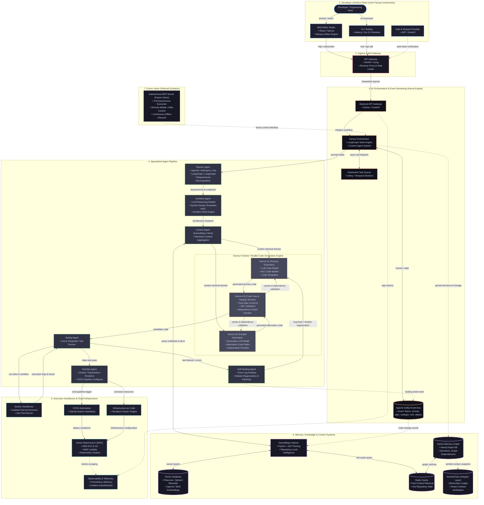

# StackPilot AI: System Architecture Specification

This document provides the formal architectural specification for **StackPilot AI**, an autonomous multi-agent software engineering platform. It documents the component breakdown, inter-agent communication channels, data flow mechanisms, memory topology, and cloud infrastructure required to deliver an end-to-end autonomous development lifecycle.

---

## 1. High-Level Architectural Model

StackPilot AI organizes distributed components into six decoupled architectural planes:

1. **Developer Interface Plane**: Client workspaces, terminal CLI runtimes, authentication, and ingress API routing.
2. **AI Orchestration & Event Streaming Plane**: Central state engine, workflow coordination, asynchronous task scheduling, and event message streaming.
3. **Specialized Autonomous Agent Pipeline**: Functional agent roles dividing requirements analysis, system architecture, parallel code generation, and verification.
4. **Karma H-Series Parallel Generation Plane**: Redundant parallel synthesis and real-time supervisory static code inspection.
5. **Memory, Knowledge & Verification Plane**: Graph-relational context memory, vector embeddings, AST codebase indexing, cache acceleration, and cryptographic verification.
6. **Execution Sandboxing & Cloud Infrastructure Plane**: Ephemeral execution containers, automated test runners, CI/CD pipelines, and cloud deployment targets.

---

## 2. Complete System Architecture Diagram



---

## 3. Detailed Component Breakdown

### 3.1 Developer Interface Plane
The Developer Interface Plane provides unified entry points for human developers to interact with the platform, eliminating the cognitive load of switching between isolated dev tools:

* **Web Studio**:
  * **Framework**: React, Next.js.
  * **Editor Integration**: Monaco Editor engine embedding language servers, syntax parsing, side-by-side git diffs, and live module inspection.
  * **Real-time Streaming**: WebSockets connecting the frontend to the backend to stream token generation, agent state transitions, and live terminal output.
* **Command Line Interface (CLI)**:
  * **Runtimes**: Node.js / Go.
  * **Purpose**: Headless execution, CI/CD pipeline triggers, local folder synchronization, and terminal-first development.
* **Authentication Service**:
  * **Mechanisms**: JSON Web Tokens (JWT) and OAuth2 identity providers.
  * **Security**: Enforces role-based access control (RBAC), tenant workspace isolation, and scoped API tokens.
* **API Gateway**:
  * **Technologies**: NGINX / Kong.
  * **Responsibilities**: Unified entry point for all incoming traffic; handles SSL/TLS termination, rate limiting, request validation, and routing to internal microservices.

---

### 3.2 AI Orchestration & Event Streaming Plane
This plane acts as the central nervous system of StackPilot AI, ensuring deterministic state progression and non-blocking asynchronous coordination:

* **Backend Services**:
  * **Framework**: Python (FastAPI).
  * **Role**: Exposes high-performance asynchronous REST and WebSocket endpoints for project initialization, telemetry streaming, and agent dispatching.
* **Karma Orchestrator**:
  * **Framework**: LangGraph / Custom Agent State Machine.
  * **Role**: Coordinates the multi-agent graph, maintaining deterministic transitions between pipeline stages. Manages the shared state dictionary (containing requirements, blueprints, AST representations, and test logs).
* **Apache Kafka Event Bus**:
  * **Role**: Centralized event streaming backbone. All agents publish and consume domain events to decouple processing stages.
  * **Key Topics**:
    * `prompt.submitted`: Initial developer prompt published by API gateway.
    * `plan.created`: Requirements broken down into features and endpoints.
    * `architecture.defined`: Framework, schema, and layout blueprint generated.
    * `context.retrieved`: Codebase context dossier assembled by KarmaRepo.
    * `codegen.completed`: Primary and alternative code candidates generated.
    * `codegen.monitored`: Integrity verification status emitted by Karma H3.
    * `test.executed`: Unit and integration test logs and assertion results.
    * `selfheal.triggered`: Remediation patch generated by the Self-Healing Agent.
    * `deployment.initiated`: Build artifacts ready for cloud provisioning.
* **Task Queue**:
  * **Technologies**: Celery / Temporal.
  * **Role**: Dispatches long-running asynchronous worker jobs such as full-codebase AST indexing, Docker container compilation, and cloud infrastructure deployment.

---

### 3.3 Specialized Agent Pipeline
StackPilot AI rejects monolithic "do-everything" prompts, replacing them with specialized agents with distinct domain boundaries:

```
[Developer Prompt]
       │
       ▼
 ┌───────────┐      Features, Endpoints,      ┌───────────┐      System Blueprint,     ┌──────────────┐
 │  Planner  │ ─────────────────────────────► │ Architect │ ─────────────────────────► │ ContextAgent │
 │   Agent   │      Modules, Schemas          │   Agent   │      Schemas, Directory    │  (KarmaRepo) │
 └───────────┘                                └───────────┘                            └──────┬───────┘
                                                                                              │
                                                                               Context Dossier│
                                                                                              ▼
 ┌───────────┐        Deployment Configs       ┌───────────┐       Clean Codebase       ┌──────────────┐
 │  DevOps   │ ◄────────────────────────────── │  Testing  │ ◄───────────────────────── │   Karma H3   │
 │   Agent   │                                 │   Agent   │       Passed AST           │ (Supervisor) │
 └─────┬─────┘                                 └─────┬─────┘                            └──────▲───────┘
       │                                             │ Failures                                │
       ▼                                             ▼                               Candidate │ Code
  Cloud Deploy                                 ┌───────────┐       Patches & Fixes             │
   (AWS/EKS)                                   │Self-Heal  │ ───────────────────────────► [ Karma H1/H2 ]
                                               │   Agent   │
                                               └───────────┘
```

#### 1. Planner Agent
* **Core Technology**: OpenAI / Anthropic frontier LLMs orchestrated with LangChain / LangGraph.
* **Input**: Natural-language developer prompt.
* **Responsibilities**: Analyzes functional intent, decomposes vague user visions into deterministic technical specifications, and specifies:
  * Functional feature breakdown.
  * Public and internal REST/GraphQL API endpoints.
  * Database structures and relational entities.
  * Modular system components.
* **Output**: Structured Requirements Specification Schema.

#### 2. Architect Agent
* **Core Technology**: LLM reasoning models, vector-retrieved system design templates, internal architectural rule engine.
* **Input**: Requirements Specification Schema from the Planner Agent.
* **Responsibilities**: Resolves technology frameworks, files/folder layouts, database schemas, and service boundaries. Enforces architectural patterns (clean architecture, microservices, or modular monoliths).
* **Output**: Architectural Blueprint and Filesystem Schema.

#### 3. Context Agent (KarmaRepo Client)
* **Core Technology**: Python, AST parser clients, vector search adapters.
* **Input**: Architectural Blueprint and target module list.
* **Responsibilities**: Queries KarmaRepo to compile a comprehensive contextual dossier containing existing project files, relevant internal API contracts, dependency definitions, and external framework documentation.
* **Output**: Contextual Generation Dossier.

#### 4. Testing Agent
* **Core Technology**: Jest runner executing inside ephemeral Docker sandboxes.
* **Input**: Candidate codebase approved by Karma H3.
* **Responsibilities**: Generates and executes comprehensive unit and integration test suites. Validates mock data, API contract responses, database queries, and boundary conditions.
* **Output**: Structured Test Report (PASS/FAIL) with assertion dumps and stack traces.

#### 5. Self-Healing Agent
* **Core Technology**: Karma Engine failure reasoning subsystem.
* **Input**: Failed Test Reports, compiler error logs, and runtime stack traces from the Testing Agent.
* **Responsibilities**: Pinpoints root-cause failure lines, generates targeted code diffs, or triggers module-level regeneration in Karma H1/H2.
* **Output**: Verified remediation patches.

#### 6. DevOps Agent
* **Core Technology**: Docker, Kubernetes manifests, GitHub Actions CI/CD workflows, Terraform IaC.
* **Input**: Tested and verified codebase.
* **Responsibilities**: Generates production-ready Dockerfiles, sets up CI/CD workflows, compiles Terraform infrastructure plans, and provisions target cloud environments (AWS).
* **Output**: Infrastructure deployment scripts, deployed endpoints, and container artifacts.

---

### 3.4 Karma H-Series Parallel Generation Plane
A major vulnerability in conventional AI software generation is single-point-of-failure hallucinations: when a single model generates invalid syntax or suboptimal architecture, the entire development pipeline halts. StackPilot AI eliminates this using the **Karma H-Series** parallel generation architecture:

```
                            Architectural Blueprint & Context
                                           │
                    ┌──────────────────────┴──────────────────────┐
                    ▼                                             ▼
        ┌───────────────────────┐                     ┌───────────────────────┐
        │  Karma H1 (Primary)   │                     │  Karma H2 (Parallel)  │
        │ • LLM Code Model      │                     │ • Secondary LLM       │
        │ • AST Code Builder    │                     │ • Redundant Logic     │
        │ • Template Engine     │                     │ • Optimization Prompts│
        └───────────┬───────────┘                     └───────────┬───────────┘
                    │                                             │
                    │         Generated Code Candidates           │
                    └──────────────────────┬──────────────────────┘
                                           │
                                           ▼
                            ┌─────────────────────────────┐
                            │   Karma H3 (Code Monitor)   │
                            │ • Tree-sitter AST Parsing   │
                            │ • ESLint Static Checks      │
                            │ • Dependency Flow Analysis  │
                            │ • Logic Consistency Audit   │
                            └──────────────┬──────────────┘
                                           │
                                           ▼
                               Passed Candidate Code
```

* **Karma H1 — Primary Code Generation Agent**:
  * **Role**: Primary developer agent synthesizing core business logic, API route handlers, database repositories, and frontend components.
  * **Tech**: Specialized LLM code models, AST code builders, structured code templates.
* **Karma H2 — Parallel Code Generation Agent**:
  * **Role**: Operates in parallel with H1, synthesizing alternative implementations of identical specifications using differing algorithms or architectural variants.
  * **Tech**: Secondary LLM code model, code optimization prompts, concurrent execution workers.
  * **Resilience Advantage**: If H1 generates deadlocked code, incorrect type mappings, or sub-optimal performance characteristics, H2 provides an immediate hot-standby implementation without restarting the pipeline.
* **Karma H3 — Code Integrity & Flow Monitor**:
  * **Role**: Real-time supervisory gatekeeper analyzing generated code streams before test execution.
  * **Tech**: **Tree-sitter** grammar parsers, **ESLint** static analysis rules, AST syntax validators.
  * **Audit Criteria**:
    * Syntax correctness across all generated files.
    * Dependency graph flow: ensures imported symbols, interfaces, and modules actually exist and resolve.
    * Architectural compliance: verifies that code adheres strictly to the layout and contracts dictated by the Architect Agent.
    * Runtime flow analysis: detects obvious runtime hazards such as unhandled promise rejections, circular dependencies, or memory leaks.
  * **Remediation**: Coordinates micro-fixes directly on the candidate stream or selects the superior candidate from H1/H2 to forward to the Testing Agent.

---

### 3.5 Memory, Knowledge & Context Plane
To eliminate AI context amnesia and provide deep repository-wide reasoning, StackPilot AI deploys a multi-tiered memory architecture:

```
                          ┌───────────────────────────┐
                          │    Developer Prompts &    │
                          │   Architectural Decisions │
                          └─────────────┬─────────────┘
                                        │
                                        ▼
    ┌───────────────────────────────────────────────────────────────────────┐
    │                         Karma Memory Graph                            │
    │  • Neo4j Property Graph DB (Nodes: Decisions, Commits, Dependencies)  │
    │  • Vector Embeddings attached to entity nodes                         │
    └───────────────────┬───────────────────────────────┬───────────────────┘
                        │                               │
                        ▼                               ▼
            ┌───────────────────────┐       ┌───────────────────────┐
            │      Redis Cache      │       │      KarmaChain       │
            │ • Sub-millisecond hot │       │ • Immutable Ledger    │
            │   context retrieval   │       │ • Smart Contract-     │
            │ • Session working set │       │   verified snapshots  │
            └───────────────────────┘       └───────────────────────┘
```

#### 1. KarmaRepo (Codebase Intelligence Engine)
* **Continuous Indexing**: Ingests files across the entire codebase, parsing them into Abstract Syntax Trees (AST) using Python-based Tree-sitter bindings.
* **Embeddings**: Employs **OpenAI / BGE** embedding models to transform AST symbols, docstrings, and function signatures into high-dimensional vectors.
* **Storage**: Ingests vectors into scalable vector databases (**Pinecone / Qdrant / Weaviate**).
* **Semantic Code Search**: Enables natural-language and symbolic queries across code modules, allowing agents to understand project-wide architecture, import chains, and helper libraries.
* **Event-Driven Invalidation**: Subscribes to Apache Kafka repository change events to incrementally re-index modified files without re-scanning the entire project.

#### 2. Karma Memory Graph (Context Retention Engine)
* **Core Technology**: **Neo4j Graph Database** integrated with vector similarity indexes.
* **Role**: Captures long-term project history. Entities stored as nodes include:
  * Developer prompts and revisions.
  * Architectural decisions and trade-offs made by the Architect Agent.
  * Code changes, commit hashes, and module diffs.
  * Internal dependencies, interface contracts, and module relationships.
* **Impact**: Eliminates context amnesia by enabling agents to query both structural relationships ("which modules depend on this data model?") and semantic concepts ("what was our strategy for authentication?").
* **Fast Caching**: Uses **Redis** as an in-memory cache for frequently accessed context nodes and active session graphs.

#### 3. KarmaChain (Integrity & Verification Layer)
* **Core Technology**: Blockchain ledger and smart contract verification protocols.
* **Role**: Provides a tamper-proof verification layer for project context:
  * Computes cryptographic hashes of verified architectural decisions, project constraints, and context snapshots.
  * Commits these snapshots to an immutable blockchain ledger.
  * Enforces smart contract verification to ensure that subsequent agent iterations do not deviate from cryptographically verified project standards or introduce unauthorized modifications.

---

### 3.6 Execution Sandboxes & Cloud Infrastructure Plane
* **Docker Sandbox Isolation**:
  * Executes unverified candidate code inside secure, resource-bounded Docker containers.
  * Prevents arbitrary code execution from impacting the host platform or neighboring workspaces.
  * Hosts the **Jest** runner for unit and integration testing.
* **CI/CD Integration**:
  * Automated generation of **GitHub Actions** workflows for continuous integration, code formatting, security linting, and automated publishing.
* **Infrastructure as Code (IaC)**:
  * Generates and executes **Terraform** scripts to provision cloud infrastructure reproducibly.
* **Cloud Infrastructure (AWS)**:
  * Scalable compute and storage primitives:
    * **AWS EC2**: Core worker virtual machines and sandbox runners.
    * **AWS S3**: Storage for build artifacts, static assets, and indexed code snapshots.
    * **AWS Lambda**: Serverless event dispatchers and background task triggers.
    * **Kubernetes (EKS)**: Scalable container orchestration running microservices and agent workers.
* **Observability & Monitoring**:
  * **Prometheus**: Real-time metrics collection tracking agent latency, token consumption, task queue depth, and sandbox test outcomes.
  * **Grafana**: Dashboards providing operational visibility across the entire multi-agent engineering lifecycle.

---

### 3.7 Future Vision: Autonomous MCP Server
*The provided StackPilot architecture document explicitly specifies the Autonomous MCP Server as a **future vision**.*

```
                 ┌──────────────────────────────────────────────┐
                 │    Autonomous MCP Server (Future Vision)     │
                 │   • Fully Self-Operating Development Engine  │
                 │   • Autonomous Build, Test, Debug & Deploy   │
                 └──────────────────────┬───────────────────────┘
                                        │
                     ┌──────────────────┴──────────────────┐
                     ▼                                     ▼
     ┌──────────────────────────────┐      ┌──────────────────────────────┐
     │   Remote Telemetry & Alert   │      │    Continuous Offline Work   │
     │ • Mobile Devices & Web Dash  │      │ • Self-healing regression    │
     │ • Real-Time Status Tracking  │      │ • Background refactoring     │
     │ • System Control & Trigger   │      │ • Deployment progression     │
     └──────────────────────────────┘      └──────────────────────────────┘
```

* **Fully Self-Operating Engine**: Designed to autonomously trigger builds, execute test suites, remediate bugs, and execute cloud deployments without active developer presence.
* **Remote Mobile & Dashboard Control**: Empowers developers to track real-time build telemetry, review system alerts, and authorize deployment promotions remotely via mobile devices and web interfaces.
* **Continuous Offline Development**: Projects will maintain forward momentum, executing background refactoring, regression patching, and CI/CD pipelines while developers are offline.

---

## 4. Architectural Data Flow & Inter-Component Contracts

| Stage | Producer | Consumer | Communication Medium | Payload / Contract |
| :--- | :--- | :--- | :--- | :--- |
| **1. Ingestion** | Web IDE / CLI | API Gateway | HTTP REST / WebSockets | Raw Prompt, User Context, Auth Token |
| **2. Pipeline Init** | API Gateway | FastAPI Backend | HTTP / Internal RPC | Authenticated Request Envelope |
| **3. Event Broadcast** | FastAPI Backend | Kafka Bus | Kafka Topic: `prompt.submitted` | Normalized Prompt Event Schema |
| **4. Requirement Spec** | Planner Agent | Architect Agent | Kafka Topic: `plan.created` | Features, Endpoints, Schemas JSON |
| **5. Architecture Spec**| Architect Agent | Context Agent | Kafka Topic: `architecture.defined`| Blueprint Schema, Directory Tree |
| **6. Context Retrieval**| Context Agent | KarmaRepo | Direct Vector / REST Query | AST Chunks, Docs, Web References |
| **7. Code Generation**  | Karma H1 / H2 | Karma H3 Monitor | Internal Shared Memory / Queue | Parallel Source Code AST Streams |
| **8. Code Validation**  | Karma H3 Monitor | Testing Agent | Kafka Topic: `codegen.monitored` | Validated Candidate Codebase |
| **9. Test Execution**  | Testing Agent | Docker Sandbox | Docker Engine API / CLI Exec | Mounted Codebase & Jest Test Suites |
| **10. Self-Healing**   | Testing Agent | Self-Healing Agent | Kafka Topic: `test.failed` | Stderr, Stack Traces, Exit Codes |
| **11. Remediation**    | Self-Healing Agent | Karma H1 Generator | Kafka Topic: `selfheal.triggered` | Root-Cause Analysis & Code Diffs |
| **12. Deployment**     | Testing Agent | DevOps Agent | Kafka Topic: `test.passed` | Verified Code Artifacts |
| **13. Cloud Provision**| DevOps Agent | AWS / Kubernetes | Terraform CLI / Kube API | Docker Images, Helm/K8s Manifests |
| **14. State Anchoring**| Orchestrator | Neo4j / KarmaChain | Bolt Protocol / Web3 RPC | Graph Nodes & Cryptographic Hashes |
