# StackPilot AI: End-to-End Workflow & Self-Healing Pipeline

This document details the operational workflow of **StackPilot AI**, tracking the progression of an engineering concept from an initial natural-language prompt through multi-agent analysis, parallel code generation, automated sandbox verification, self-healing remediation, and cloud deployment.

---

## 1. Workflow Pipeline Diagram

The following Mermaid diagram maps the end-to-end operational pipeline, highlighting the decision branches, parallel generation mechanics, and the automated self-healing feedback loop:

```mermaid
flowchart TD
    %% =========================================================================
    %% STYLING
    %% =========================================================================
    classDef startNode fill:#1e1e2e,stroke:#89b4fa,stroke-width:2px,color:#cdd6f4;
    classDef stageNode fill:#313244,stroke:#a6e3a1,stroke-width:2px,color:#cdd6f4;
    classDef parallelNode fill:#45475a,stroke:#f9e2af,stroke-width:2px,color:#cdd6f4;
    classDef decisionNode fill:#181825,stroke:#fab387,stroke-width:2px,color:#cdd6f4;
    classDef healNode fill:#313244,stroke:#f38ba8,stroke-width:2px,color:#cdd6f4;
    classDef successNode fill:#1e1e2e,stroke:#94e2d5,stroke-width:2px,color:#cdd6f4;
    classDef futureNode fill:#181825,stroke:#cba6f7,stroke-dasharray: 5 5,stroke-width:2px,color:#cdd6f4;

    %% =========================================================================
    %% PIPELINE NODES
    %% =========================================================================
    Idea([Developer Idea / Requirement Prompt]):::startNode
    
    subgraph Stage1_Intake ["Stage 1: Prompt Intake"]
        Intake["Developer submits idea via Web Editor Studio or CLI Tool<br/>• Request authenticated via JWT/OAuth<br/>• Ingress handled via API Gateway (NGINX/Kong)<br/>• Published to Apache Kafka Event Bus"]:::stageNode
    end

    subgraph Stage2_Analysis ["Stage 2: Requirement Analysis"]
        Planner["Planner Agent evaluates objective (OpenAI / Anthropic LLM)<br/>• Decomposes into Functional Features<br/>• Specifies REST / GraphQL API Endpoints<br/>• Defines Relational / Document Database Structures<br/>• Establishes Component Modules"]:::stageNode
    end

    subgraph Stage3_Architecture ["Stage 3: Architecture Planning"]
        Architect["Architect Agent formulates technical blueprint<br/>• Decides Language & Framework (e.g., React, FastAPI, Node)<br/>• Resolves Project Folder Structure & Module Boundaries<br/>• Synthesizes Database Schema & Entity Relationships<br/>• Queries System Design Templates via Vector RAG"]:::stageNode
    end

    subgraph Stage4_Context ["Stage 4: Context Retrieval (KarmaRepo)"]
        Context["Context Agent queries KarmaRepo Codebase Intelligence<br/>• Vector DB Semantic Search (Pinecone / Qdrant / Weaviate)<br/>• AST Code Parsing & Symbol Extraction<br/>• Documentation & Existing Project File Retrieval<br/>• Domain-Specific Web Scraping for target concepts"]:::stageNode
    end

    subgraph Stage5_ParallelGen ["Stage 5: Parallel Code Generation (Karma H-Series)"]
        H1["Karma H1 (Primary Generator)<br/>• LLM Code Model + AST Builder<br/>• Generates Main APIs, Logic & Modules"]:::parallelNode
        H2["Karma H2 (Parallel Generator)<br/>• Secondary LLM + Optimization Prompts<br/>• Generates Alternative Code Paths"]:::parallelNode
    end

    subgraph Stage6_Integrity ["Stage 6: Code Integrity & Flow Monitoring"]
        H3["Karma H3 (Supervisory Monitor)<br/>• Tree-sitter Syntax Validation<br/>• ESLint Static Code Analysis<br/>• Dependency Graph & Runtime Flow Verification<br/>• Selects / Synthesizes Verified Candidate Stream"]:::stageNode
    end

    subgraph Stage7_Testing ["Stage 7: Isolated Test Execution"]
        Tester["Testing Agent executes Test Suite<br/>• Ephemeral Docker Execution Sandbox<br/>• Automated Jest Unit & Integration Tests<br/>• Captures Exit Codes, Logs, and Assertion Dumps"]:::stageNode
    end

    subgraph Stage8_Feedback ["Stage 8: Decision & Self-Healing Feedback Loop"]
        TestDecision{Errors Detected<br/>in Test Run?}:::decisionNode
        SelfHeal["Self-Healing Agent (Powered by Karma Engine)<br/>• Ingests Test Failure Logs & Error Stack Traces<br/>• Identifies Faulty Code Lines & Root Causes<br/>• Generates Bug Patches / Triggers Module Regeneration"]:::healNode
    end

    subgraph Stage9_DevOps ["Stage 9: DevOps Automation & Deployment"]
        DevOps["DevOps Agent automates delivery<br/>• Builds Production Docker Containers<br/>• Generates Kubernetes Manifests<br/>• Configures GitHub Actions CI/CD<br/>• Compiles Terraform Infrastructure as Code (IaC)<br/>• Provisions & Deploys to AWS Cloud (EC2, S3, Lambda, EKS)"]:::stageNode
        StateAnchor["State Anchoring & Context Commitment<br/>• Commit Decisions & Lineage to Karma Memory Graph (Neo4j)<br/>• Anchor Cryptographic Context Snapshots on KarmaChain"]:::successNode
        LiveApp([Application Live in Production]):::successNode
    end

    subgraph Stage10_Future ["Stage 10: Autonomous MCP Server (Future Vision)"]
        AutonomousMCP["Autonomous MCP Server (Planned)<br/>• Supervision-Free Build, Test, Debug & Deploy Cycles<br/>• Remote Mobile & Dashboard Telemetry / Control<br/>• Continuous Progress While Developers are Offline"]:::futureNode
    end

    %% =========================================================================
    %% PIPELINE TRANSITIONS
    %% =========================================================================
    Idea --> Intake
    Intake -->|"Normalized Prompt Event"| Planner
    Planner -->|"Structured Requirements Spec"| Architect
    Architect -->|"System Architecture Blueprint"| Context
    Context -->|"Enriched Context Dossier"| H1
    Context -->|"Enriched Context Dossier"| H2

    H1 -->|"Primary Code Stream"| H3
    H2 -->|"Alternative Code Stream"| H3

    H3 -->|"Syntactically Validated Code"| Tester
    Tester -->|"Test Output Logs"| TestDecision

    %% Self-Healing Feedback Loop
    TestDecision -- "Yes (Failures / Errors)" --> SelfHeal
    SelfHeal -->|"Remediation Patch / Module Regeneration"| H1
    SelfHeal -.->|"Re-verify Syntax"| H3

    %% Clean Path to Deployment
    TestDecision -- "No (All Tests Passed)" --> DevOps
    DevOps --> StateAnchor
    StateAnchor --> LiveApp

    %% Future Vision Linkage
    LiveApp -.->|"Future Autonomous Oversight"| AutonomousMCP
```

---

## 2. Granular Stage-by-Stage Breakdown

### Stage 1: Prompt Intake
* **Input**: Natural-language application vision, issue ticket, or architectural feature request from the developer.
* **Responsible Components**: Web Studio (React / Monaco Editor), CLI Tool (Node.js / Go), API Gateway (NGINX / Kong).
* **Processing Mechanics**:
  1. The developer enters a prompt or command via the web workspace or CLI terminal.
  2. The API Gateway authenticates the caller via JWT/OAuth, verifies permissions, and applies rate limiting.
  3. The request is encapsulated into a standard event payload and published to the `prompt.submitted` topic on the Apache Kafka event bus.
* **Output**: Authenticated, normalized `PromptIntakeEvent` containing user intent, project identifiers, and workspace metadata.
* **What Happens Next**: The Karma Orchestrator picks up the event and activates the Planner Agent.

---

### Stage 2: Requirement Analysis
* **Input**: `PromptIntakeEvent`.
* **Responsible Agent**: **Planner Agent** (leveraging OpenAI / Anthropic frontier LLMs orchestrated with LangChain / LangGraph).
* **Processing Mechanics**:
  1. Parses the natural-language prompt and deconstructs ambiguity into deterministic engineering tasks.
  2. Identifies user personas, core application features, and business logic constraints.
  3. Formalizes API endpoints (HTTP methods, URL paths, input validation payloads, and response structures).
  4. Outlines database entity-relationship models (schemas, relations, indexes).
  5. Determines required application modules and integration boundaries.
* **Output**: `RequirementsSpecification` JSON schema outlining:
  * Functional Features List.
  * Public & Private API Endpoints.
  * Database Entity Specifications.
  * High-level Module Breakdown.
* **What Happens Next**: Emits a `plan.created` event and invokes the Architect Agent.

---

### Stage 3: Architecture Planning
* **Input**: `RequirementsSpecification` JSON schema.
* **Responsible Agent**: **Architect Agent** (LLM reasoning models, vector-retrieved design templates, architectural rule engine).
* **Processing Mechanics**:
  1. Queries the vector database for system design prompt templates matching the application domain via vector RAG.
  2. Applies an internal architectural rule engine to resolve the ideal technology stack (e.g., Next.js frontend, FastAPI backend, PostgreSQL database).
  3. Establishes the project directory tree, naming conventions, and file-level responsibilities.
  4. Formulates detailed database schemas (DDL/migration files, ORM models) and service communication protocols.
* **Output**: `ArchitecturalBlueprint` defining:
  * Frameworks, runtimes, and package dependencies.
  * Complete repository folder hierarchy.
  * Database schemas and configuration specifications.
  * Module dependency graphs and interface contracts.
* **What Happens Next**: Emits an `architecture.defined` event and invokes the Context Agent.

---

### Stage 4: Context Retrieval (KarmaRepo)
* **Input**: `ArchitecturalBlueprint` and target module specifications.
* **Responsible Agent**: **Context Agent (KarmaRepo Client)**.
* **Processing Mechanics**:
  1. **Codebase Semantic Search**: Executes vector similarity searches against **Pinecone / Qdrant / Weaviate** using OpenAI/BGE embeddings to identify related existing project files and reusable helper utilities.
  2. **AST Symbol Retrieval**: Traverses Abstract Syntax Trees (AST) using Python-based parsers to inspect symbol definitions, exported types, and function signatures in adjacent modules.
  3. **Documentation Indexing**: Extracts relevant documentation, framework API manuals, and local design decisions.
  4. **Domain Web Scraping**: If the application requires domain-specific external APIs or novel patterns, executes targeted web scraping to retrieve API contract documentation.
  5. **Cache Optimization**: Checks **Redis** cache for hot symbols and existing dependency trees to minimize retrieval latency.
* **Output**: `ContextDossier` containing file trees, type signatures, referenced libraries, and interface contracts.
* **What Happens Next**: Publishes `context.retrieved` and triggers parallel code generation in the Karma H-Series.

---

### Stage 5: Parallel Code Generation (Karma H-Series)
* **Input**: `ArchitecturalBlueprint` and `ContextDossier`.
* **Responsible Agents**: **Karma H1 (Primary Generator)** and **Karma H2 (Parallel Generator)**.
* **Processing Mechanics**:
  1. **Karma H1 Execution**: Uses specialized LLM code models, AST code builders, and verified code templates to synthesize the primary implementation (core backend logic, route controllers, services, database repositories).
  2. **Karma H2 Execution**: Operates simultaneously using a secondary LLM model with alternative optimization and design prompts. Synthesizes an independent implementation of identical specifications.
  3. **Concurrency Advantage**: Eliminates blocking stalls caused by single-agent hallucinations or suboptimal implementations by producing redundant candidate paths in parallel.
* **Output**: Dual candidate code streams (Primary implementation and Alternative implementation).
* **What Happens Next**: Both candidate streams are ingested by Karma H3 for continuous supervisory evaluation.

---

### Stage 6: Code Integrity & Flow Monitoring
* **Input**: Candidate code streams from Karma H1 and Karma H2.
* **Responsible Agent**: **Karma H3 (Code Integrity & Flow Monitor)**.
* **Processing Mechanics**:
  1. **AST Validation**: Parses generated files through **Tree-sitter** to verify grammar, syntax validity, and token completeness.
  2. **Static Code Analysis**: Runs **ESLint** and language-specific linters to identify undeclared variables, type mismatches, and convention violations.
  3. **Dependency Graph Inspection**: Verifies that every `import` and `require` statement points to an existing file, package, or exported identifier.
  4. **Runtime Flow Audit**: Scans for common logical failure modes (unhandled promise rejections, missing error catches, unclosed database connections, infinite loops).
  5. **Resolution**: If one generator stream exhibits errors, H3 attempts inline AST fixes or selects the healthy alternative stream.
* **Output**: Verified, structurally coherent `CandidateCodebase` ready for sandbox execution.
* **What Happens Next**: Dispatches the codebase to the Testing Agent.

---

### Stage 7: Automated Testing
* **Input**: `CandidateCodebase` approved by Karma H3.
* **Responsible Agent**: **Testing Agent**.
* **Processing Mechanics**:
  1. Spins up an isolated, ephemeral **Docker sandbox** container containing the target language runtime, dependencies, and testing tools.
  2. Mounts the candidate codebase into the container volume.
  3. Synthesizes and executes **Jest** unit test suites (validating individual functions, classes, and utilities) and integration test suites (validating API routes, mock HTTP calls, and database transactions).
  4. Captures standard output (stdout), error streams (stderr), execution exit codes, and assertion failure messages.
* **Output**: `TestExecutionReport`:
  * Status: `PASSED` or `FAILED`.
  * Summary: Passed/failed assertions count, code coverage metrics, runtime duration.
  * Failure Dumps: Stack traces, failed expectations, and compiler warnings.
* **What Happens Next**:
  * If Status is `PASSED` $\rightarrow$ Proceeds immediately to **Stage 9 (DevOps Automation)**.
  * If Status is `FAILED` $\rightarrow$ Routes immediately to **Stage 8 (Self-Healing Loop)**.

---

### Stage 8: Self-Healing & Debugging Feedback Loop
* **Input**: `TestExecutionReport` containing error logs, stack traces, and the failing code files.
* **Responsible Agent**: **Self-Healing Agent** (powered by the Karma Engine).
* **Processing Mechanics**:
  1. **Log Ingestion & Parsing**: Extracts exact line numbers, thrown exception types, assertion mismatches, and execution traces from test logs.
  2. **Root-Cause Analysis**: Correlates the runtime exception with the source code AST and contextual dependency graph to isolate the exact defect.
  3. **Remediation Strategy**:
     * *Targeted Patch*: If the bug is a localized syntax error, inverted condition, or minor type mismatch, synthesizes a targeted code diff.
     * *Module Regeneration*: If the failure is architectural or structural, directs Karma H1/H2 to regenerate the faulty module with corrective prompt constraints.
  4. **Patch Application**: Applies the fix directly to the candidate codebase.
* **Output**: `RemediationPatch` applied to the candidate files.
* **What Happens Next**:
  * Automatically loops back to **Stage 7 (Testing Agent)** to re-run the test suite inside the Docker sandbox.
  * *Convergence Protection*: The Karma Orchestrator maintains a retry counter to prevent infinite remediation loops; if iterations exceed configured thresholds, a notification event is emitted.

---

### Stage 9: DevOps Automation & Cloud Deployment
* **Input**: Fully validated, green-tested codebase and `ArchitecturalBlueprint`.
* **Responsible Agent**: **DevOps Agent**.
* **Processing Mechanics**:
  1. **Container Packaging**: Generates multi-stage **Dockerfiles** and `docker-compose.yml` manifests optimized for minimal footprint and security.
  2. **Orchestration Manifests**: Generates **Kubernetes** manifests (Deployments, Services, Ingress, ConfigMaps, Secrets).
  3. **CI/CD Configuration**: Writes automated **GitHub Actions** workflows (`.github/workflows/deploy.yml`) for building, scanning, and deploying the application.
  4. **Infrastructure as Code (IaC)**: Generates and applies **Terraform** configuration files to provision cloud resources on **AWS** (EC2 instances, S3 buckets, Lambda functions, or EKS clusters).
  5. **Cloud Deployment Execution**: Executes deployment routines to launch the containerized application on the provisioned AWS infrastructure.
  6. **Context Anchoring**:
     * Commits all architectural decisions, prompt lineages, and code state to the **Karma Memory Graph** in **Neo4j**.
     * Computes a cryptographic hash of the verified state snapshot and commits it to **KarmaChain** via smart contract verification.
* **Output**: Live production URL, container registry image digest, Terraform state file, and verified KarmaChain transaction receipt.
* **What Happens Next**: Application enters live operations; runtime metrics stream to **Prometheus** and **Grafana**.

---

### Stage 10: Autonomous MCP Server *(Future Vision)*
*The provided StackPilot architecture document explicitly defines this capability as a **future vision**.*

* **Role**: Operates as a permanent background server leveraging the Model Context Protocol (MCP) to manage the entire engineering pipeline without ongoing human supervision.
* **Operational Scope**:
  * **Autonomous Lifecycle Execution**: Once an initial project roadmap or requirement prompt is initiated, the MCP server autonomously coordinates builds, test suites, bug fixes, refactoring, and cloud deployments.
  * **Remote Mobile & Dashboard Supervision**: Developers monitor operational telemetry, review system alerts, and issue workflow commands remotely through mobile devices or web dashboards.
  * **Offline Development Progression**: Software projects continue progressing, fixing regressions, and deploying updates continuously even when developers are offline.
